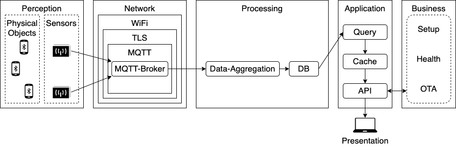
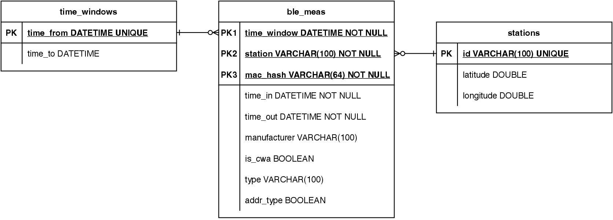
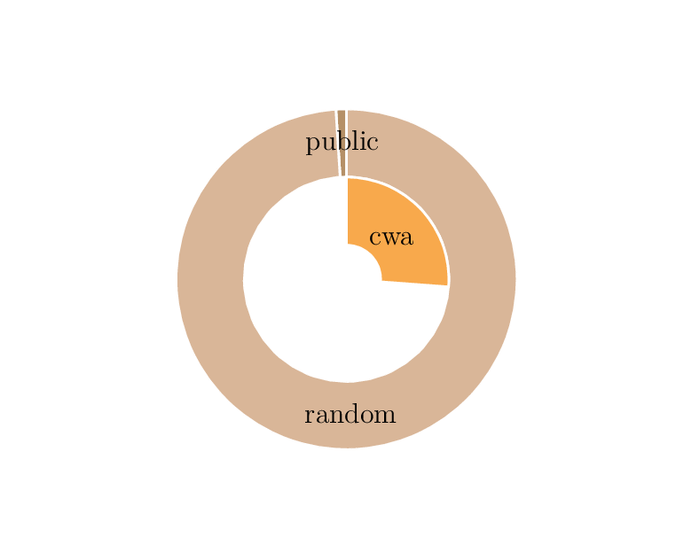

# Crowd Flow Analysis on the Basis of randomized Bluetooth-MAC-addresses logged by an ESP32

Logging bluetooth advertisements for crowd flow analysis was a common method before MAC address randomization was established.
But for the short time of 15 minutes one bluetooth MAC address can be traced anyways.
Even transitions can be recognized between measurements of different loggers.
This repository supplies the infrastructure for safely transmitting, transforming and persisting measured data.

# System Architecture
This repository covers the layers Network and Processing of the following figure.
Associated perception layer is implemented on an ESP32 with [Bluetooth-Logger Firmware](https://github.com/kiliandangendorf/esp32-bluetooth-logger) specially developed for this purpose.


The so called Bluetooth-Logger are logging bluetooth advertisements.
Each measurement will be published on a specific MQTT topic.
The Data-Aggregation subscribes these topics and processes measurement.
According to GDPR data will be anonymized and stored into DB after.
Devices are identified by their MAC-address and aggregated into time windows of 2 minutes.
For each device the timestamp of first and last advertisement in each time window will be stored.

The following database model represents stored measurements.

Querying this data can generate evaluations such as rush hours, high-traffic locations, and crowd flow.


# Setup
## Create Certificates
- one root certificate
- two server certificates
    - one for MQTT-Broker
    - one for HTTPS-OTA-Server

Store private key of root certificate carefully (`ca.key`).
The root certificate every client needs, here Bluetooth-Logger and Data-Aggregation.
Copy `ca.crt` into `data_aggregation/files/certs/`.

### Config Certificate Script
For easy creation of certificates you may use the script `generate_new_certs_menu.sh` in `tls_certificates/`.
At first you'll need to edit this file.
Here you need to add some info about your server.

- Set url or IP of your server in variable `CN`.
    Note to choose `CN` the same as you connect to your server later.
    If you connect via IP, choose IP, if you have an dynamic name, choose this one here.
- Set country, state or province name, locality and organization name in `SUBJECT_BASE`.
    As an example: `SUBJECT_BASE="/C=US/ST=San Fransisco/L=San Fransisco/O=Example Company"`

Run script
```
sh ./generate_new_certs_menu.sh
```
and choose which action to perform.
Note: Depending on option this may delete or overwrite certificates in this folder. 
Make sure to backup files, you'll need later.

Place server certificates keypair (`server.crt` and `server.key`) for each in:
- MQTT: `mqtts_broker/certs/` and
- HTTPS: `https_server_ota_bins/files/certs/`


## Config MQTT ACL
Set MQTT username-passwords-tupels in file `/docker/mqtts_broker/pwfile` in the following way:
```
user1:clear-password1
user2:clear-password2
```
Then run 
```
mosquitto_passwd -U password_file.conf
``` 
to hash it.

To add further users run:
```
mosquitto_passwd -b password_file.conf <new-user> <clear-password>
```
This will add one user with hashes password in this file.

Usernames stated here belonging to defined roles in file `/docker/mqtts_broker/acl_file.conf`

## Config Data Aggregation
Edit file `data_aggregation/files/config.py`:
- Under `MQTT_CFG`
    - set IP Hostname in `MQTT_BROKER`
    - set `MQTT_USERNAME` and `MQTT_PASSWD` according to MQTTs ACL-file
    - you may specify `SENSORS_TOPIC` and `ADMIN_TOPIC` to less generic topics
- Match settings under `DB_CFG` to those in `docker-compose.yaml`

## Ports
Following Ports should be opened on server and reachable for the Bluetooth-Logger:
- 8883 for MQTTS (in case of unencrypted communication it is 1883)
- 2008 for HTTPS


# Deployment
After [Setup](#setup) is done, run change to folder `docker/` and run:
```
docker-compose up -d
```
Then service `data_aggregation` will collect all arriving messages into time windows of 2 minutes length
The Service `data_aggregation` will collect all arriving messages into time windows of 2 minutes length.
Entries of these time windows will be stored in db each two minutes have passed.
The db-schema will be created if not exists.
So after deployment you'll have to wait at least two minutes until you can find first data in database.


# Querying Data

To give an example on querying the following example returns summed up devices counts of each Bluetooth-Logger in the given time interval from `@time_from` to `@time_to`.
```sql
SET @time_from = '2022-08-21 12:00:00.0';
SET @time_to = '2022-08-21 12:30:00.0';

SELECT station, COUNT(DISTINCT mac) AS devices_count
FROM ble_meas
WHERE timewindow IN (SELECT time_from
                      FROM ble_timewindows
                      WHERE time_from >= @time_from
                        AND time_to <= @time_to)
GROUP BY station;
```

As a result the following table allows us to infer the number of visitors per area with the help of an extrapolation factor.
|Bluetooth-Logger|Count of unique MAC addresses|
|---|---:|
|sensor/BLE/Scanner/\<ssid\>/1|344|
|sensor/BLE/Scanner/\<ssid\>/2|766|
|sensor/BLE/Scanner/\<ssid\>/5|794|
|sensor/BLE/Scanner/\<ssid\>/6|784|
|sensor/BLE/Scanner/\<ssid\>/8|376|
|sensor/BLE/Scanner/\<ssid\>/9|619|

# OTA Update
Place bin-files in `https_server_ota_bins/files/bins/`.
This folder is mounted as read-only volume.
Files of this folder will be accessible under url: `https://<your-host>:2008/`

To start update for example version 1.1.20, place file `firmware-1-1-20.bin` in folder mentioned above and publish following MQTT-message:
Topic: `ota/BLE/Scanner/<logger-id>`
```json
{
	"version": "1.1.20",
	"url": "https://<your-host>:2008/firmware-1-1-20.bin"
}
```


<!-- # Statitics
<p align="center">
    
</p> -->

# License

[Licensed under the MIT License](https://opensource.org/licenses/MIT).

This software was developed in the context of my master thesis, which I wrote in the company [ATMINA Solutions GmbH](https://atmina.de).

